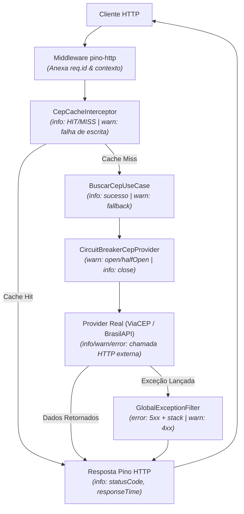

# Arquitetura e Implementação de Logging

Este documento descreve a arquitetura, decisões técnicas e comportamento operacional do sistema de logging estruturado implementado em todas as camadas da aplicação utilizando **Pino** e [`nestjs-pino`](https://github.com/iamolegga/nestjs-pino).

---

## 1. Visão Geral & Motivação

Antes do logging estruturado, a aplicação dependia de instruções `console.log` não padronizadas no bootstrap e blocos `catch` silenciosos/não tratados nos casos de uso e camadas de cache. Isso tornava o diagnóstico de falhas, o monitoramento de latência das APIs externas e o rastreamento de requisições inviáveis em ambientes de produção.

Para garantir observabilidade de nível corporativo e prontidão para produção, o **Pino** foi selecionado como motor de logging através do `nestjs-pino`.

### Principais Benefícios

- **Altíssima Performance & Baixo Overhead:** O Pino é reconhecido como um dos loggers mais rápidos do ecossistema Node.js, com impacto mínimo de CPU e memória graças ao streaming assíncrono e não bloqueante.
- **Logging Estruturado em JSON:** Os logs são emitidos como objetos JSON em linha única (NDJSON) em produção, aderindo aos pipelines modernos de ingestão de logs (como Datadog, ELK/OpenSearch, AWS CloudWatch, Grafana Loki e Google Cloud Operations).
- **Correlação de Requisições (Tracing):** Cada requisição HTTP recebe um identificador único (`req.id` em formato UUID v4), que é automaticamente vinculado a qualquer log emitido durante o ciclo de vida dessa requisição.
- **Redução de Ruído:** Rotas de alta frequência de monitoramento (`/health`) são explicitamente filtradas para evitar poluição e custos excessivos de ingestão de logs.
- **Cobertura em Todas as Camadas:** Desde a camada de transporte HTTP até o cache, fallbacks nos casos de uso de domínio, transições de estado do circuit breaker e requisições HTTP externas de saída.

---

## 2. Configuração & Variáveis de Ambiente

O comportamento do logging é controlado via variáveis de ambiente e estritamente validado na inicialização da aplicação usando Zod em `src/shared/config/env.validation.ts`:

| Variável    |                           Tipo                            |    Padrão     | Descrição                                                                                         |
| :---------- | :-------------------------------------------------------: | :-----------: | :------------------------------------------------------------------------------------------------ |
| `LOG_LEVEL` | Enum (`trace`, `debug`, `info`, `warn`, `error`, `fatal`) |    `info`     | Nível mínimo de severidade dos logs emitidos pelo Pino.                                           |
| `NODE_ENV`  |        Enum (`development`, `production`, `test`)         | `development` | Determina o formato: `production` emite NDJSON bruto; qualquer outro valor ativa o `pino-pretty`. |

### Exemplo de Configuração no `.env`

```env
# Configuração de Logging
LOG_LEVEL=info
NODE_ENV=development
```

### Registro do Módulo (`src/app.module.ts`)

O `LoggerModule` é registrado dinamicamente de forma assíncrona para injetar o `ConfigService`:

```typescript
LoggerModule.forRootAsync({
  imports: [ConfigModule],
  inject: [ConfigService],
  useFactory: (configService: ConfigService<Env, true>) => {
    const isProduction =
      configService.get('NODE_ENV', { infer: true }) === 'production';

    return {
      pinoHttp: {
        level: configService.get('LOG_LEVEL', { infer: true }),
        transport: isProduction
          ? undefined
          : {
              target: 'pino-pretty',
              options: {
                singleLine: false,
              },
            },
        genReqId: () => randomUUID(),
        autoLogging: {
          ignore: (req) => req.url === '/health',
        },
      },
    };
  },
});
```

---

## 3. Correlação & Rastreamento de Requisições

O `nestjs-pino` conecta um middleware HTTP que atribui um identificador de correlação (UUID v4) a cada requisição de entrada:

```
Requisição de Entrada (GET /cep/01001000)
    │
    ▼
Middleware pino-http: Gera req.id via randomUUID() (ex: 8f9b2d1c-...)
    │
    ├─► Interceptor: [req.id=8f9b2d1c-...] Cache MISS for CEP 01001000
    │
    ├─► Use Case:    [req.id=8f9b2d1c-...] Provider ViaCEP succeeded in 120ms
    │
    ├─► Provider:    [req.id=8f9b2d1c-...] Outbound GET https://viacep.com.br/ws/01001000/json/
    │
    └─► Middleware:  [req.id=8f9b2d1c-...] Request completed 200 OK (responseTime: 125ms)
```

Como o `PinoLogger` utiliza o contexto assíncrono da requisição no NestJS (`AsyncLocalStorage`), todas as mensagens de log emitidas dentro de providers, casos de uso e interceptors herdam automaticamente os metadados de `req` (`id`, `method`, `url`, `headers`, `remoteAddress`). Ao investigar um incidente de usuário ou falha em produção, basta filtrar pelo `req.id` para obter todos os eventos correlacionados daquela execução específica.

---

## 4. Filtragem de Rotas (Redução de Ruído)

Orquestradores de containers (probes do Kubernetes, health checks do AWS ECS, load balancers) consultam a rota `/health` a cada poucos segundos. Emitir logs para cada health check introduz ruído desnecessário e infla os custos de armazenamento.

A filtragem de rotas é implementada nativamente em `pinoHttp.autoLogging.ignore`:

```typescript
autoLogging: {
  ignore: (req) => req.url === '/health',
}
```

Isso garante:

1. Health checks são executados com zero overhead de log.
2. Endpoints normais da aplicação (`GET /cep/:cep`) permanecem totalmente auditados com tempo de resposta e status codes.

---

## 5. Arquitetura & Logging por Camadas

O logging foi implementado como uma preocupação transversal (cross-cutting concern) em todas as camadas da aplicação:



### 5.1. Middleware de Requisição/Resposta HTTP (`pino-http`)

- **Escopo:** Logging automático de todo tráfego HTTP de entrada (exceto `/health`).
- **Dados Logados:** Método, rota, parâmetros da requisição, status code da resposta e tempo total de processamento (`responseTime` em ms).
- **Nível de Log:** `info`.

### 5.2. Camada de Cache (`CepCacheInterceptor`)

Localizado em `src/modules/cep/presentation/interceptors/cep-cache.interceptor.ts`.

- **Cache HIT:** Logado no nível `info` com contexto `CepCacheInterceptor`, `{ cep, cache: 'HIT' }`.
- **Cache MISS:** Logado no nível `info` com contexto `CepCacheInterceptor`, `{ cep, cache: 'MISS' }`.
- **Falhas de Escrita no Cache:** Tratadas de forma assíncrona sem interromper a resposta HTTP. Se o provedor de cache falhar ao salvar uma entrada positiva ou negativa, a falha é capturada e registrada no nível `warn` com `{ cep, cacheKey, error }`.

### 5.3. Camada de Aplicação / Caso de Uso (`BuscarCepUseCase`)

Localizado em `src/modules/cep/application/use-cases/buscar-cep.use-case.ts`.

- **Sucesso do Provider:** Quando um provider retorna um CEP válido, o caso de uso emite uma mensagem em nível `info` contendo `{ provider, cep, durationMs }`.
- **Fallback de Provider:** Quando um provider lança uma exceção (timeout, erro DNS, 5xx ou circuito aberto), o caso de uso registra um log de nível `warn` com `{ provider, cep, durationMs, error }` antes de chavear para o próximo provider da sequência no Round-Robin.

### 5.4. Provedores Externos (`ViaCepProvider`, `BrasilApiProvider` & `BaseHttpCepProvider`)

Localizados em `src/modules/cep/infrastructure/providers/`.

- **Latência de Saída HTTP:** Toda requisição externa registra o tempo de início e término via `performance.now()`.
- **Sucesso (2xx):** Logado no nível `info` com `{ provider, url, durationMs, statusCode }`.
- **Erros do Cliente (4xx):** Logados no nível `warn` com `{ provider, url, durationMs, statusCode, error }`.
- **Erros de Servidor (5xx) e Falhas de Rede/Timeout:** Logados no nível `error` com `{ provider, url, durationMs, statusCode, error }`.

### 5.5. Circuit Breaker (`CircuitBreakerCepProvider`)

Localizado em `src/shared/circuit-breaker/circuit-breaker-cep-provider.ts`.

Listeners de eventos configurados diretamente na instância do breaker Opossum:

- `open`: Logado no nível `warn` com `{ provider, event: 'open' }`, alertando que o limite de falhas foi excedido e o modo fail-fast foi ativado.
- `halfOpen`: Logado no nível `warn` com `{ provider, event: 'halfOpen' }`, sinalizando que o timeout expirou e requisições de teste estão sendo permitidas.
- `close`: Logado no nível `info` com `{ provider, event: 'close' }`, indicando recuperação saudável e fechamento do circuito.

### 5.6. Filtro Global de Exceções (`GlobalExceptionFilter`)

Localizado em `src/shared/filters/global-exception.filter.ts`.

- **Erros 5xx de Servidor & Exceções Não Tratadas (`statusCode >= 500`):**
  - Logados no nível `error`.
  - Inclui stack trace completo (`err`), método, rota, status code e mensagem do erro.
  - Cobre `AllProvidersFailedException` (`502 Bad Gateway`) e falhas inesperadas de infraestrutura.
- **Erros 4xx de Cliente (`400 <= statusCode < 500`):**
  - Logados no nível `warn`.
  - Não inclui stack trace para evitar poluição de logs com falhas de validação de input do cliente (`InvalidCepException` - `400 Bad Request`, `CepNotFoundException` - `404 Not Found`).

### 5.7. Bootstrap da Aplicação (`src/main.ts`)

- `app.useLogger(app.get(Logger))` substitui o logger de console padrão do NestJS.
- O `PinoLogger` de escopo transient é resolvido assincronamente via `await app.resolve(PinoLogger)` e injetado no `GlobalExceptionFilter`.
- Substitui `console.log` puros por `logger.log(...)` estruturado para URLs de inicialização e disponibilidade do Swagger.

---

## 6. Exemplos de Saída e Schema dos Logs

### 6.1. Saída JSON em Produção (`NODE_ENV=production`)

Em ambientes de produção, os logs são emitidos em formato NDJSON para processamento automatizado:

#### Requisição Concluída com Sucesso (200 OK)

```json
{
  "level": 30,
  "time": 1772810263851,
  "pid": 21540,
  "hostname": "srv-app-01",
  "req": {
    "id": "c7a86f91-5360-4e4f-b4c4-90a9b3d014bc",
    "method": "GET",
    "url": "/cep/01001000",
    "query": {},
    "params": { "0": "cep/01001000" },
    "headers": {
      "host": "api.dominio.com",
      "user-agent": "curl/7.88.1",
      "accept": "*/*"
    },
    "remoteAddress": "192.168.1.100",
    "remotePort": 54321
  },
  "res": {
    "statusCode": 200,
    "headers": {
      "x-powered-by": "Express",
      "x-cache": "MISS",
      "content-type": "application/json; charset=utf-8"
    }
  },
  "responseTime": 128,
  "msg": "request completed"
}
```

#### Cache Miss & Cache Hit

```json
{"level":30,"time":1772810263800,"pid":21540,"context":"CepCacheInterceptor","cep":"01001000","cache":"MISS","msg":"Cache MISS for CEP 01001000"}
{"level":30,"time":1772810264100,"pid":21540,"context":"CepCacheInterceptor","cep":"01001000","cache":"HIT","msg":"Cache HIT for CEP 01001000"}
```

#### Requisição HTTP Externa para o Provider

```json
{
  "level": 30,
  "time": 1772810263820,
  "pid": 21540,
  "context": "ViaCepProvider",
  "provider": "ViaCEP",
  "url": "https://viacep.com.br/ws/01001000/json/",
  "durationMs": 95,
  "statusCode": 200
}
```

#### Fallback de Provider no Caso de Uso (Aviso)

```json
{
  "level": 40,
  "time": 1772810263825,
  "pid": 21540,
  "context": "BuscarCepUseCase",
  "provider": "ViaCEP",
  "cep": "01001000",
  "durationMs": 5002,
  "error": "timeout of 5000ms exceeded",
  "msg": "Provider ViaCEP failed for CEP 01001000: timeout of 5000ms exceeded"
}
```

#### Evento do Circuit Breaker

```json
{
  "level": 40,
  "time": 1772810263830,
  "pid": 21540,
  "provider": "ViaCEP",
  "event": "open",
  "msg": "Circuit breaker opened for ViaCEP"
}
```

#### Erro 5xx com Stack Trace (`GlobalExceptionFilter`)

```json
{
  "level": 50,
  "time": 1772810263840,
  "pid": 21540,
  "context": "GlobalExceptionFilter",
  "statusCode": 502,
  "error": "Bad Gateway",
  "message": "All CEP providers failed. Please try again later.",
  "path": "/cep/01001000",
  "method": "GET",
  "err": {
    "type": "AllProvidersFailedException",
    "message": "All CEP providers failed. Please try again later.",
    "stack": "AllProvidersFailedException: All CEP providers failed. Please try again later.\n    at BuscarCepUseCase.execute (C:/app/src/modules/cep/application/use-cases/buscar-cep.use-case.ts:56:13)"
  },
  "msg": "All CEP providers failed. Please try again later."
}
```

---

### Comandos de Execução dos Testes

```bash
# Executa a suíte de testes completa (unitários, integração e e2e)
npm test

# Executa testes com análise de cobertura de código
npm run test:coverage
```
